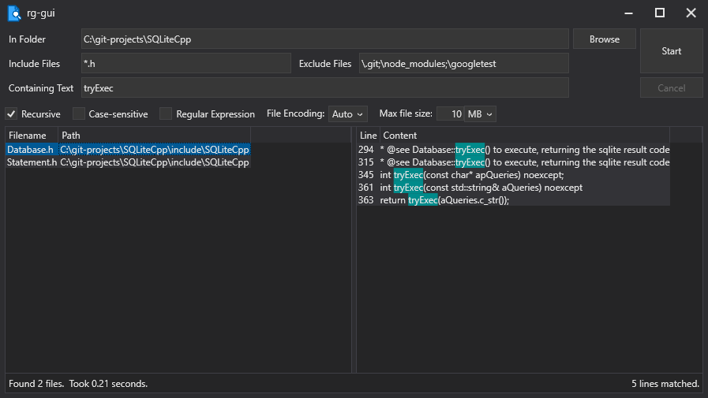

# rg-gui: A Simple RipGrep GUI for Windows

## Installation

Download the latest release of rg-gui from the [Releases page](https://github.com/kcowolf/rg-gui/releases).  Unzip it to a convenient location such as `C:\rg-gui`.

The RipGrep executable `rg.exe` is included in the rg-gui release.  It needs to be in the same folder as `rg-gui.exe`.

The **.NET Desktop Runtime 6** must also be installed.  You can download it from here: https://dotnet.microsoft.com/en-us/download/dotnet/6.0

## Usage

Select a folder using the Browse button or by typing the path into the "In Folder" box.

Include Files and Exclude Files can be path or file names and can include wildcards.  Multiple names can be specified, separated by commas, semicolons, or spaces.

Finally, type the text you would like to search for in the "Containing Text" box.  Press the Start button to start your search.

## Settings

### Theme

Color theme for the app.  Light and Dark themes are included.

### Maximum Search Terms

Maximum number of terms (a word or quoted string) which can be typed in the "Containing Text" box.  This number determines the maximum number of processes rg-gui will run while searching.

### Multi-color Highlighting

If a search contains multiple terms, the results for each term can be highlighted in a separate color (up to 4 colors).  If this is disabled, results for all terms will be highlighted using the same color.

## Credits

rg-gui was written by Benjamin Stauffer (kcowolf).

Icon based on Line Hero Unlimited v2.4.1 - 02032020, file_find_search.png
https://wishforge.itch.io/3000-free-icons

Special thanks to Andrew Gallant (BurntSushi) for the [RipGrep](https://github.com/BurntSushi/ripgrep) tool.

Theme engine based on [WPFDarkTheme](https://github.com/AngryCarrot789/WPFDarkTheme).  Theme colors originally based on [ThemeWPF](https://github.com/Verta-IT/ThemeWPF/tree/main/Source/VertaIT.WPF.Theme).

## License

All files are distributed under the [MIT License](LICENSE) unless otherwise specified.  ShellContextMenu.cs is licensed under The Code Project Open License (CPOL) 1.02, https://www.codeproject.com/info/cpol10.aspx.  SHOpenFolderAndSelectItems.cs is licensed under the BSD 2-Clause License, BSD 2-Clause License, https://opensource.org/license/bsd-2-clause.
