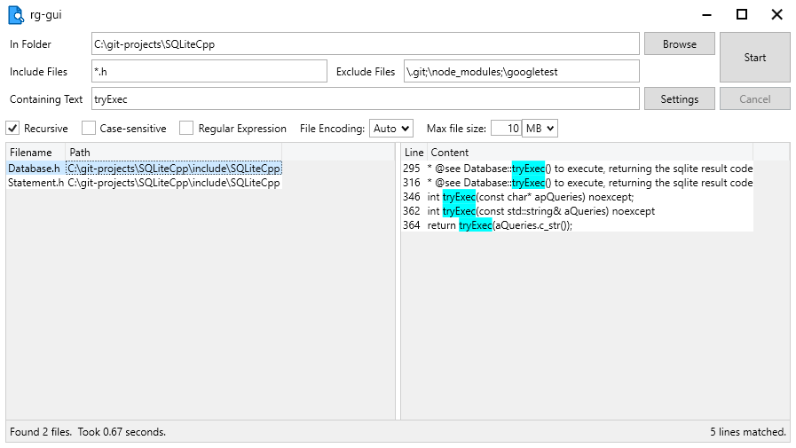

# rg-gui: A Simple RipGrep GUI for Windows

 
## Installation

RipGrep must be installed on your computer.  You can download it from [here](https://github.com/BurntSushi/ripgrep/releases).  Currently, version 13.0.0 is supported.  Unzip it to a convenient location such as `C:\ripgrep-13.0.0-x86_64-pc-windows-msvc`.

Download the latest release of rg-gui from the [Releases page](https://github.com/kcowolf/rg-gui/releases).  Unzip it to a convenient location such as `C:\rg-gui`.

## Usage

Select a folder using the Browse button or by typing the path into the "In Folder" box.

Include Files and Exclude Files can be path or file names and can include wildcards.  Multiple names can be specified, separated by commas, semicolons, or spaces.

Finally, type the text you would like to search for in the "Containing Text" box.  Press the Start button to start your search.

## Credits

rg-gui was written by Benjamin Stauffer (kcowolf).

Icon based on Line Hero Unlimited v2.4.1 - 02032020, file_find_search.png
https://wishforge.itch.io/3000-free-icons

Special thanks to Andrew Gallant (BurntSushi) for the [RipGrep](https://github.com/BurntSushi/ripgrep) tool.

## License

All files are distributed under the [MIT License](LICENSE) unless otherwise specified.  ShellContextMenu.cs is licensed under The Code Project Open License (CPOL) 1.02, https://www.codeproject.com/info/cpol10.aspx.
