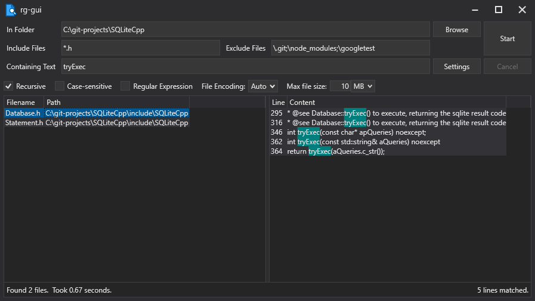

# rg-gui: A Simple RipGrep GUI for Windows




[](https://opensource.org/licenses/MIT)
 
## Installation

Download the latest installer from https://github.com/kcowolf/rg-gui/releases.  The installer includes the RipGrep executable rg.exe, which is expected to be installed to the same folder as rg-gui.

## Usage

Select a folder using the Browse button or by typing the path into the "In Folder" box.

Include Files and Exclude Files can be path or file names and can include wildcards.  Multiple names can be specified, separated by commas, semicolons, or spaces.

Finally, type the text you would like to search for in the "Containing Text" box.  Press the Start button to start your search.


## Themes

Theme can be selected in rg-gui.dll.config.  Valid values are "Light" and "Dark".

```xml
<add key="Theme" value="Light"/>
```

## Credits

rg-gui was written by Benjamin Stauffer (kcowolf).

Icon based on Line Hero Unlimited v2.4.1 - 02032020, file_find_search.png
https://wishforge.itch.io/3000-free-icons

Special thanks to Andrew Gallant (BurntSushi) for the [RipGrep](https://github.com/BurntSushi/ripgrep) tool.

Theme engine based on [WPFDarkTheme](https://github.com/AngryCarrot789/WPFDarkTheme).  Theme colors originally based on [ThemeWPF](https://github.com/Verta-IT/ThemeWPF/tree/main/Source/VertaIT.WPF.Theme).

## License

All files are distributed under the [MIT License](LICENSE) unless otherwise specified.  ShellContextMenu.cs is licensed under The Code Project Open License (CPOL) 1.02, https://www.codeproject.com/info/cpol10.aspx.
